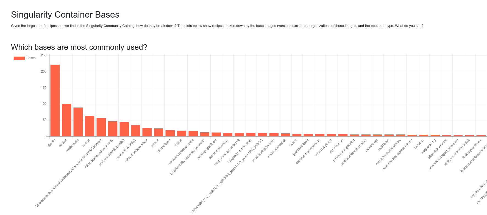

# Singularity Catalog


This is the Singularity Community Catalog, or Singularity recipe files discovered
in the wild across the community! It is another version of the [spack-stack-catalog](https://spack.github.io/spack-stack-catalog) (pushed second, but developed first!), which itself is inpired by the [snakemake-workflow-catalog](https://github.com/snakemake/snakemake-workflow-catalog) that is released under an [MIT LICENSE](.github/SNAKEMAKE-LICENSE).

⭐ [View the Catalog](https://singularityhub.github.io/singularity-catalog/) ⭐

If you want your recipes to be added to the catalog, they simply need to be
discoverable via a GitHub search. The repository must be public, and the recipe
must be named according to the published convention, "Singularity" or "Singularity*"

## How does it work?

A Singularity recipe is a definition file to build a Singularity container. It can be thought of as a packaged set of packages to install alongside a configuration. Following convention specified in the [Singularity publication](https://journals.plos.org/plosone/article?id=10.1371/journal.pone.0177459#sec042)and thousands of recipes on GitHub that were built on Singularity Hub, Singularity recipes are typically represented in a "Singularity" file, akin to a Dockerfile, optionally with an extension to indicate a particular tag. This means that we can easily discover these files across GitHub using the GitHub API and present a catalog here. This is the Singularity community catalog! 🎉️ You can come here to find recipe examples, and browse what the community is working on. While there are many thousands of recipes online, we include recipes based on the following criteria: 

- We parse the 1000 most recently indexed on a nightly basis
- Your file must be named following the Singularity published convention. If Singularity is in the name of the .def file it might be discovered, but since *.def is not specific enough to Singularity, we cannot search for these files.
- The recipe is contained in a public Github repository.
- The repository is small enough to be cloned into a Github actions job.
- The repository is not [blacklisted](blacklist.txt).

Additionally, we now support adding repos and search expressions to [repos.txt](repos.txt),
so a repository with *.def files (which are not specific to Singularity and would not be
possible to search with the GitHub API) can be added.

## Usage

### Install Dependencies

The update of repositories that have Singularity* recipes is done during an automated CI,
however you might want to run the update script locally. You can first install
requirments:

```bash
python -m venv env
pip install -r requirements.txt
```

### Environment

You'll need to export a personal access token as `GITHUB_TOKEN`:

```bash
export GITHUB_TOKEN=xxxxxxxxxxx
```

### Run update script

Then, run the script!

```bash
python scripts/generate-catalog.py
```

This should be run nightly to update the recipes here.

## Calculate Metrics

If you run the script [generate-graph-data.py](generate-graph-data.py) you
can generate the [containers.yaml](_data/containers.yaml) data file that
shows counts of base containers, tags, and bootstraps.

```bash
python scripts/generate-graph-data.py
```


